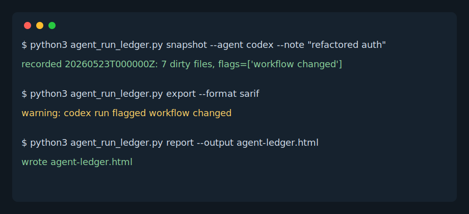

# Agent Run Ledger

Track what each AI coding agent changed before you hand the repo to the next one.

Agent Run Ledger is a zero-dependency CLI that records every agent run into a small `.agent-ledger/runs.json` file, then renders a reviewable HTML timeline and SARIF warnings for risky handoffs.

## Demo



## Why This Exists

Teams are starting to mix Codex, Cursor, Copilot, Claude Code, custom MCP tools, and local scripts in the same repository. The hard part is no longer "can an agent edit code?" It is "what changed, who changed it, and is this safe to hand to the next agent?"

Agent Run Ledger gives every run a receipt:

- agent name and note
- branch and commit
- dirty files
- insertions and deletions
- risk flags for large diffs, workflow changes, lockfile changes, and secret-adjacent files
- JSON and SARIF output for automation

## Quick Start

```bash
python3 agent_run_ledger.py snapshot --agent codex --note "implemented CLI parser"
python3 agent_run_ledger.py report --output agent-ledger.html
python3 agent_run_ledger.py export --format sarif > agent-ledger.sarif
```

Open `agent-ledger.html` before merging or before handing the repo to another agent.

## GitHub Actions

Add this workflow to publish SARIF-style warnings when risky agent runs are recorded:

```yaml
name: Agent Run Ledger

on:
  pull_request:

jobs:
  ledger:
    runs-on: ubuntu-latest
    steps:
      - uses: actions/checkout@v4
      - name: Export agent ledger SARIF
        run: python3 agent_run_ledger.py export --format sarif > agent-ledger.sarif
      - name: Upload SARIF
        uses: github/codeql-action/upload-sarif@v3
        with:
          sarif_file: agent-ledger.sarif
```

The repository includes `.github/workflows/ci.yml` for tests.

## Machine Output

JSON:

```bash
python3 agent_run_ledger.py export --format json
```

SARIF:

```bash
python3 agent_run_ledger.py export --format sarif
```

## What Gets Flagged

- `.env`, `.pem`, `.key`, or `.token` files changed
- package lockfiles changed
- GitHub Actions workflows changed
- very large agent edits

## License

MIT
